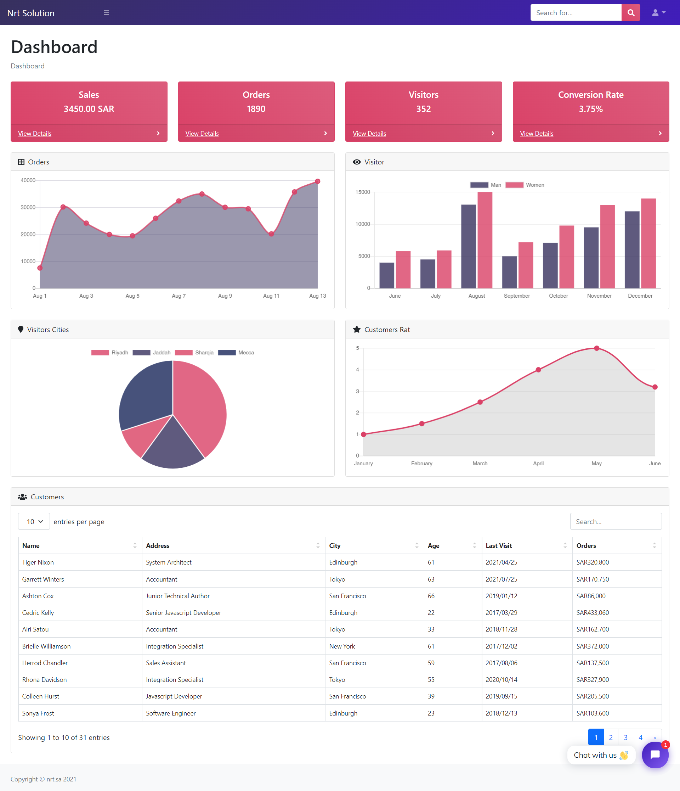

#  Dashboard

## Introduction
Simple responsive front-end dashboard. This dashboard uses the Bootstrap styles along with a variety of powerful libraries and tools to create a powerful admin panel.

### Technologies Used:
* HTML
* CSS
* JavaScript
* [Fontawesome](https://fontawesome.com/ "Fontawesome")
* [Bootstrap](https://getbootstrap.com/ "Bootstrap")
* [ Chartjs](https://www.chartjs.org/ " Chartjs")
* [ Datatables](https://datatables.net/ " Chartjs")
* [Tidio](https://www.tidio.com/ "Tidio")

## Project Prototype
- Home Page

#### deployment link
https://hossamdev-dashboard.netlify.app/

